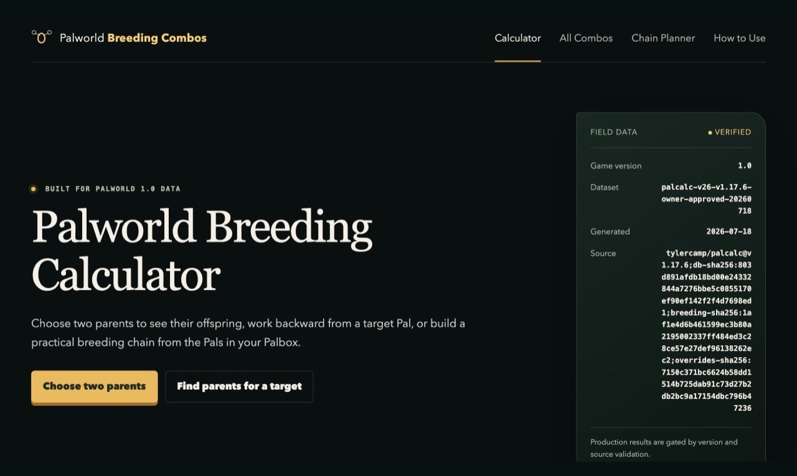

# Palworld Breeding Combos

[Palworld Breeding Combos](https://palworldbreedingcombos.com/) is a free,
ad-free browser tool for planning Palworld 1.0 breeding combinations and
practical breeding chains.

[Open the calculator](https://palworldbreedingcombos.com/)



## What the tool does

- Choose two parent Pals and calculate the expected offspring.
- Select a target Pal and compare possible parent combinations.
- Add Pals from your Palbox and find a short breeding chain.
- Browse 44,851 breeding combinations across 300 Pals.
- Check the supported game version, dataset revision, generated date, and
  verification status with each result.

## Main tools

- [Breeding Calculator](https://palworldbreedingcombos.com/)
- [All Breeding Combos](https://palworldbreedingcombos.com/combos/)
- [Breeding Chain Planner](https://palworldbreedingcombos.com/chain/)
- [How to Use](https://palworldbreedingcombos.com/how-to-use/)
- [Breeding Guide](https://palworldbreedingcombos.com/guide/)
- [Data Sources](https://palworldbreedingcombos.com/data-sources/)

## Privacy and pricing

- Free to use
- No advertising or affiliate links
- No account required
- No save-file upload required
- Palbox selections remain in the user's browser

## Local development

Requirements:

- Node.js 20 or later
- npm

Install dependencies and build the production site:

```bash
npm install
npm run build
npm run check
npm run check:compliance
```

The generated static site is written to `dist/`.

## Data and accuracy boundary

The production dataset is pinned to a documented source revision and is
published with hashes, a generated date, verification evidence, and known
gaps. See [`data/README.md`](data/README.md) and the
[public data-sources page](https://palworldbreedingcombos.com/data-sources/)
before relying on a result for a particular game version.

The current normalized dataset references
[`tylercamp/palcalc` v1.17.6](https://github.com/tylercamp/palcalc/releases/tag/v1.17.6).
The upstream repository is MIT licensed. Extracted game data and Palworld
names remain subject to their respective rights and the limitations documented
in this repository.

## Project status and licensing

This repository is public for project transparency and issue reporting.
No license grant for this repository's original code or content is provided
unless a file or dependency states otherwise.

## Disclaimer

Palworld Breeding Combos is an independent, unofficial fan-made tool. It is not
affiliated with or endorsed by Pocketpair.

Palworld and related names are trademarks of their respective owners. No game
files or official game artwork are distributed by this project.

## Contact

For data corrections, privacy or legal requests, and site feedback, email
[contact@palworldbreedingcombos.com](mailto:contact@palworldbreedingcombos.com).
